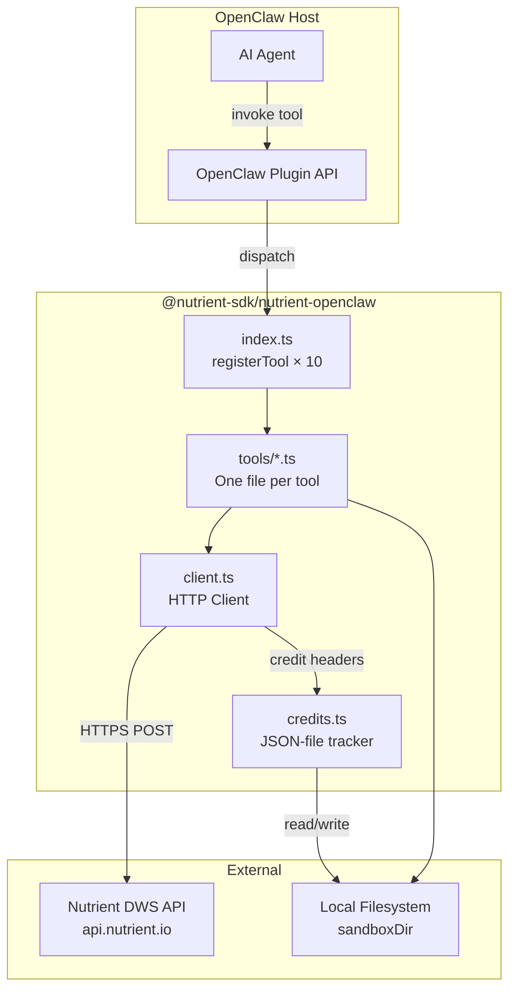

# @nutrient-sdk/nutrient-openclaw — Architecture

> Native OpenClaw plugin for document processing via the Nutrient DWS API.

## 1. High-Level Component Diagram



**Design principle:** Each tool is a thin adapter — read file, call API, write result, return status. All complexity lives in the shared client and the DWS API itself.

## 2. File / Folder Structure

```
nutrient-openclaw/
├── openclaw.plugin.json          # Plugin manifest (configSchema, metadata)
├── index.ts                      # Entry point: export default function(api)
├── src/
│   ├── client.ts                 # Shared HTTP client (ported from MCP api.ts)
│   ├── credits.ts                # Credit tracking (JSON file, no native deps)
│   ├── types.ts                  # Shared TypeScript types
│   ├── errors.ts                 # Error classification & formatting
│   └── tools/
│       ├── convert-to-pdf.ts     # nutrient_convert_to_pdf
│       ├── convert-to-image.ts   # nutrient_convert_to_image
│       ├── convert-to-office.ts  # nutrient_convert_to_office
│       ├── extract-text.ts       # nutrient_extract_text
│       ├── ocr.ts                # nutrient_ocr
│       ├── watermark.ts          # nutrient_watermark
│       ├── redact.ts             # nutrient_redact (pattern-based)
│       ├── ai-redact.ts          # nutrient_ai_redact (AI-powered)
│       ├── sign.ts               # nutrient_sign
│       └── check-credits.ts      # nutrient_check_credits
├── test/
│   ├── client.test.ts            # HTTP client tests
│   ├── credits.test.ts           # Credit tracker tests
│   └── tools/                    # One test file per tool
│       ├── convert-to-pdf.test.ts
│       └── ...
├── tsconfig.json
├── package.json
├── vitest.config.ts
├── LICENSE                       # MIT
└── README.md
```

**Why no merge/flatten tools?** These are actions within the build pipeline. `convert-to-pdf` already accepts `actions[]` which covers merge (multiple parts), flatten, rotate. Separate tools would duplicate the build call with no new API surface. 10 tools, not 12. Simpler.

### File Descriptions

| File | Purpose |
|------|---------|
| `openclaw.plugin.json` | Plugin identity, version, npm package name, `configSchema` for apiKey + sandboxDir |
| `index.ts` | Default export function that receives `api`, registers all 10 tools |
| `src/client.ts` | `callNutrientApi(endpoint, data, opts)` — ported from MCP `api.ts`, uses native `fetch` instead of axios |
| `src/credits.ts` | Append-only JSON lines file for credit events; `logCredits()`, `getBalance()`, `getUsage()` |
| `src/types.ts` | `ToolResponse`, `CreditEntry`, config types |
| `src/errors.ts` | `formatError(e)` → `ToolResponse` with proper error messages |
| `src/tools/*.ts` | Each exports `{ name, description, parameters, execute }` — a tool definition object |

## 3. `openclaw.plugin.json` Manifest

```json
{
  "id": "nutrient-openclaw",
  "name": "Nutrient Document Processing",
  "description": "Process, convert, sign, redact, OCR, and extract data from documents via the Nutrient DWS API.",
  "version": "0.1.0",
  "repository": "github:nicbou/nutrient-openclaw",
  "configSchema": {
    "type": "object",
    "required": ["apiKey"],
    "additionalProperties": false,
    "properties": {
      "apiKey": {
        "type": "string",
        "description": "Nutrient DWS API key (from https://www.nutrient.io/)"
      },
      "sandboxDir": {
        "type": "string",
        "description": "Optional directory to restrict file reads/writes. When set, all file paths are resolved relative to this directory."
      }
    }
  },
  "uiHints": {
    "apiKey": {
      "label": "API Key",
      "help": "Your Nutrient DWS API key",
      "sensitive": true,
      "placeholder": "pdf_live_..."
    },
    "sandboxDir": {
      "label": "Sandbox Directory",
      "help": "Restrict file operations to this directory (optional)",
      "placeholder": "~/documents"
    }
  }
}
```

**Simplification note:** Only 2 config fields. The MCP server gets its API key from env vars; we get it from config. sandboxDir is optional — when unset, paths resolve normally against the filesystem.

## 4. `index.ts` Entry Point Pattern

```typescript
import { makeClient } from './src/client.js';
import { CreditTracker } from './src/credits.js';
import { convertToPdf } from './src/tools/convert-to-pdf.js';
import { convertToImage } from './src/tools/convert-to-image.js';
import { convertToOffice } from './src/tools/convert-to-office.js';
import { extractText } from './src/tools/extract-text.js';
import { ocr } from './src/tools/ocr.js';
import { watermark } from './src/tools/watermark.js';
import { redact } from './src/tools/redact.js';
import { aiRedact } from './src/tools/ai-redact.js';
import { sign } from './src/tools/sign.js';
import { checkCredits } from './src/tools/check-credits.js';

export default function nutrientPlugin(api: any) {
  const config = api.getConfig();
  const client = makeClient(config.apiKey);
  const credits = new CreditTracker(config.sandboxDir);

  // Shared context passed to every tool's execute()
  const ctx = { client, credits, sandboxDir: config.sandboxDir };

  const tools = [
    convertToPdf, convertToImage, convertToOffice,
    extractText, ocr, watermark, redact, aiRedact,
    sign, checkCredits,
  ];

  for (const tool of tools) {
    api.registerTool({
      name: tool.name,
      description: tool.description,
      parameters: tool.parameters,
      execute: (args: any) => tool.execute(args, ctx),
    });
  }

  return {
    name: 'nutrient',
    version: '0.1.0',
  };
}
```

**Key insight:** Every tool module exports the same shape `{ name, description, parameters, execute(args, ctx) }`. The context (`ctx`) carries the HTTP client, credit tracker, and sandbox config — no globals, no singletons, fully testable.

## 5. Shared HTTP Client Design

Ported from MCP server's `api.ts` but simplified: **native `fetch` replaces axios** (Node 18+ built-in, zero deps).

```typescript
// src/client.ts

export interface NutrientClient {
  post(endpoint: string, body: FormData | object, opts?: { timeout?: number }): Promise<NutrientResponse>;
}

export interface NutrientResponse {
  ok: boolean;
  status: number;
  data: ArrayBuffer | string;
  creditsUsed: number | null;
  creditsRemaining: number | null;
}

const API_BASE = 'https://api.nutrient.io';
const CREDIT_HEADER = 'x-pspdfkit-credit-usage';
const REMAINING_HEADER = 'x-pspdfkit-remaining-credits';

export function makeClient(apiKey: string): NutrientClient {
  return {
    async post(endpoint, body, opts = {}) {
      const url = `${API_BASE}/${endpoint}`;
      const headers: Record<string, string> = {
        Authorization: `Bearer ${apiKey}`,
        'User-Agent': 'NutrientOpenClawPlugin/0.1.0',
      };

      const isFormData = body instanceof FormData;
      const fetchBody = isFormData ? body : JSON.stringify(body);
      if (!isFormData) headers['Content-Type'] = 'application/json';

      const controller = new AbortController();
      const timeoutId = opts.timeout
        ? setTimeout(() => controller.abort(), opts.timeout)
        : undefined;

      try {
        const res = await fetch(url, {
          method: 'POST',
          headers,
          body: fetchBody,
          signal: controller.signal,
        });

        const creditsUsed = parseFloat(res.headers.get(CREDIT_HEADER) ?? '') || null;
        const creditsRemaining = parseFloat(res.headers.get(REMAINING_HEADER) ?? '') || null;

        const contentType = res.headers.get('content-type') ?? '';
        const data = contentType.includes('json')
          ? await res.text()
          : await res.arrayBuffer();

        return { ok: res.ok, status: res.status, data, creditsUsed, creditsRemaining };
      } finally {
        if (timeoutId) clearTimeout(timeoutId);
      }
    },
  };
}
```

**What changed vs MCP `api.ts`:**
- `fetch` instead of `axios` (no dependency)
- `ArrayBuffer` instead of streams (simpler, files are bounded in size)
- Credit headers extracted inline (no separate `logCreditUsage` — that's the caller's job)
- No `responseType: 'stream'` — we buffer the whole response (DWS responses are single documents, not unbounded streams)

## 6. Tool Schemas

### Standard Response Type (all tools)

```typescript
interface ToolResponse {
  success: boolean;
  output?: string;    // Human-readable result message or JSON data
  error?: string;     // Error message when success=false
  credits_used?: number;
}
```

### Tool Definitions

#### `nutrient_convert_to_pdf`
Convert documents (DOCX, XLSX, PPTX, HTML, images) to PDF.

| Param | Type | Required | Description |
|-------|------|----------|-------------|
| `filePath` | string | ✅ | Input file path |
| `outputPath` | string | ✅ | Output PDF path |
| `password` | string | | Password for protected input |
| `pages` | `{start, end}` | | Page range (0-based) |
| `htmlLayout` | `{orientation, size, margin}` | | Layout for HTML input |
| `actions` | Action[] | | Post-conversion actions (flatten, rotate, merge parts) |
| `optimize` | object | | PDF optimization options |
| `metadata` | `{title, author}` | | Set document metadata |

**Returns:** `{ success, output: "Converted to PDF: /path/to/out.pdf", credits_used }`

#### `nutrient_convert_to_image`
Render PDF pages as PNG/JPEG/WebP images.

| Param | Type | Required | Description |
|-------|------|----------|-------------|
| `filePath` | string | ✅ | Input PDF path |
| `outputPath` | string | ✅ | Output image path |
| `format` | `"png"\|"jpeg"\|"webp"` | | Image format (default: png) |
| `pages` | `{start, end}` | | Pages to render |
| `width` | number | | Output width in px |
| `height` | number | | Output height in px |
| `dpi` | number | | Output resolution |

**Returns:** `{ success, output: "Rendered to image: /path/to/out.png", credits_used }`

#### `nutrient_convert_to_office`
Convert PDF to DOCX, XLSX, or PPTX.

| Param | Type | Required | Description |
|-------|------|----------|-------------|
| `filePath` | string | ✅ | Input PDF path |
| `outputPath` | string | ✅ | Output file path |
| `format` | `"docx"\|"xlsx"\|"pptx"` | ✅ | Target format |

**Returns:** `{ success, output: "Converted to DOCX: /path/to/out.docx", credits_used }`

#### `nutrient_extract_text`
Extract text, tables, or key-value pairs from documents.

| Param | Type | Required | Description |
|-------|------|----------|-------------|
| `filePath` | string | ✅ | Input file path |
| `mode` | `"text"\|"tables"\|"key-values"` | | Extraction mode (default: text) |
| `language` | string \| string[] | | OCR language(s) |

**Returns:** `{ success, output: "<extracted JSON content>" }` — output is the raw JSON from the API.

#### `nutrient_ocr`
Apply OCR to a scanned PDF, making text selectable/searchable.

| Param | Type | Required | Description |
|-------|------|----------|-------------|
| `filePath` | string | ✅ | Input PDF path |
| `outputPath` | string | ✅ | Output PDF path |
| `language` | string | ✅ | OCR language |

**Returns:** `{ success, output: "OCR applied: /path/to/out.pdf", credits_used }`

#### `nutrient_watermark`
Add text or image watermarks to a document.

| Param | Type | Required | Description |
|-------|------|----------|-------------|
| `filePath` | string | ✅ | Input PDF path |
| `outputPath` | string | ✅ | Output PDF path |
| `watermarkType` | `"text"\|"image"` | ✅ | Watermark kind |
| `text` | string | | Text content (when type=text) |
| `imagePath` | string | | Image file path (when type=image) |
| `width` | string \| number | ✅ | Watermark width (px or "50%") |
| `height` | string \| number | ✅ | Watermark height (px or "50%") |
| `opacity` | number | | 0–1 (default: 0.7) |
| `rotation` | number | | Degrees counter-clockwise |

**Returns:** `{ success, output: "Watermarked: /path/to/out.pdf", credits_used }`

#### `nutrient_redact`
Pattern-based redaction (preset patterns, regex, or text search).

| Param | Type | Required | Description |
|-------|------|----------|-------------|
| `filePath` | string | ✅ | Input PDF path |
| `outputPath` | string | ✅ | Output PDF path |
| `strategy` | `"preset"\|"regex"\|"text"` | ✅ | Redaction strategy |
| `preset` | string | | Preset name (e.g. "email-address", "social-security-number") |
| `regex` | string | | Regex pattern |
| `text` | string | | Text to find and redact |
| `caseSensitive` | boolean | | Case sensitivity (default: false for text, true for regex) |

**Returns:** `{ success, output: "Redacted: /path/to/out.pdf", credits_used }`

#### `nutrient_ai_redact`
AI-powered redaction — detects and removes sensitive information automatically.

| Param | Type | Required | Description |
|-------|------|----------|-------------|
| `filePath` | string | ✅ | Input document path |
| `outputPath` | string | ✅ | Output path |
| `criteria` | string | | What to redact (default: "All personally identifiable information") |

**Returns:** `{ success, output: "AI redaction complete: /path/to/out.pdf", credits_used }`

> ⚠️ Typically takes 60–120 seconds. Timeout set to 5 minutes.

#### `nutrient_sign`
Digitally sign a PDF (CMS or CAdES).

| Param | Type | Required | Description |
|-------|------|----------|-------------|
| `filePath` | string | ✅ | Input PDF path |
| `outputPath` | string | ✅ | Output signed PDF path |
| `signatureType` | `"cms"\|"cades"` | | Signature type (default: cms) |
| `signerName` | string | | Signer's name |
| `reason` | string | | Signing reason |
| `location` | string | | Signing location |
| `pageIndex` | number | | Page for visible signature (omit for invisible) |
| `rect` | [number, number, number, number] | | Bounding box [left, top, w, h] in PDF points |

**Returns:** `{ success, output: "Signed: /path/to/out.pdf", credits_used }`

#### `nutrient_check_credits`
Check API credit balance and usage.

| Param | Type | Required | Description |
|-------|------|----------|-------------|
| `action` | `"balance"\|"usage"` | ✅ | What to check |
| `period` | `"day"\|"week"\|"month"\|"all"` | | Time period for usage (default: week) |

**Returns:** `{ success, output: "<JSON summary>" }`

## 7. Error Handling Strategy

Three error classes, one format:

```typescript
// src/errors.ts

import { ToolResponse } from './types.js';

export function formatError(e: unknown): ToolResponse {
  if (e instanceof NutrientApiError) {
    return { success: false, error: `API error (${e.status}): ${e.message}`, credits_used: e.creditsUsed ?? undefined };
  }
  if (e instanceof FileError) {
    return { success: false, error: `File error: ${e.message}` };
  }
  if (e instanceof ConfigError) {
    return { success: false, error: `Configuration error: ${e.message}` };
  }
  return { success: false, error: `Unexpected error: ${e instanceof Error ? e.message : String(e)}` };
}

export class NutrientApiError extends Error {
  constructor(public status: number, message: string, public creditsUsed?: number) {
    super(message);
  }
}

export class FileError extends Error {}
export class ConfigError extends Error {}
```

**Error scenarios and handling:**

| Scenario | Error Class | Example Message |
|----------|-------------|-----------------|
| Missing API key | `ConfigError` | `"API key not configured. Set it in plugin settings."` |
| Invalid API key (401) | `NutrientApiError` | `"API error (401): Invalid API key"` |
| File not found | `FileError` | `"File error: /path/to/file.pdf not found"` |
| File outside sandbox | `FileError` | `"File error: Path escapes sandbox directory"` |
| Output = Input path | `FileError` | `"File error: Output must differ from input"` |
| API rate limit (429) | `NutrientApiError` | `"API error (429): Rate limit exceeded"` |
| API server error (5xx) | `NutrientApiError` | `"API error (500): Internal server error"` |
| Timeout (ai_redact) | `NutrientApiError` | `"API error: Request timed out after 300s"` |
| Insufficient credits | `NutrientApiError` | `"API error (402): Insufficient credits"` |

**Philosophy:** Every tool wraps its `execute()` in try/catch → `formatError()`. The agent always gets a clean `{ success: false, error: "..." }` — never a stack trace.

## 8. Testing Strategy

**Framework:** Vitest (fast, native ESM, TypeScript)

**Approach:**

```
test/
├── client.test.ts         # Mock fetch globally, test request formation & header parsing
├── credits.test.ts        # Temp dir, test append/read/aggregate
├── tools/
│   ├── convert-to-pdf.test.ts
│   ├── ai-redact.test.ts
│   ├── sign.test.ts
│   └── ...                # One per tool
└── fixtures/
    ├── sample.pdf         # Tiny valid PDF for file-read tests
    └── api-responses/     # Saved API response payloads
        ├── build-success.bin
        ├── build-error.json
        └── ...
```

**Mock strategy:**

```typescript
// test/helpers.ts
import { NutrientClient, NutrientResponse } from '../src/client.js';

export function mockClient(overrides: Partial<NutrientResponse> = {}): NutrientClient {
  return {
    post: vi.fn().mockResolvedValue({
      ok: true,
      status: 200,
      data: new ArrayBuffer(100),  // fake PDF bytes
      creditsUsed: 1,
      creditsRemaining: 999,
      ...overrides,
    }),
  };
}

export function mockCredits(): CreditTracker {
  return new CreditTracker(tmpdir());  // real tracker, temp dir
}
```

**What we test per tool:**
1. Happy path → correct API endpoint called, file written, response shaped correctly
2. Missing required params → appropriate error
3. API error response → `{ success: false, error }` with details
4. File-not-found → `FileError`
5. Sandbox escape → `FileError`

**What we DON'T test:** The Nutrient DWS API itself. All HTTP is mocked. Integration tests are out of scope for the plugin — they belong in the MCP server.

## 9. Build & Publish Pipeline

### `package.json`

```json
{
  "name": "@nutrient-sdk/nutrient-openclaw",
  "version": "0.1.0",
  "description": "OpenClaw plugin for document processing via Nutrient DWS API",
  "license": "MIT",
  "type": "module",
  "main": "dist/index.js",
  "types": "dist/index.d.ts",
  "files": ["dist/", "openclaw.plugin.json", "README.md", "LICENSE"],
  "scripts": {
    "build": "tsc",
    "test": "vitest run",
    "test:watch": "vitest",
    "lint": "tsc --noEmit",
    "prepublishOnly": "npm run build && npm run test"
  },
  "devDependencies": {
    "typescript": "^5.5",
    "vitest": "^2.0"
  },
  "engines": {
    "node": ">=18"
  },
  "publishConfig": {
    "access": "public"
  }
}
```

**Zero runtime dependencies.** `fetch` and `FormData` are built into Node 18+. No axios, no form-data, no better-sqlite3.

### `tsconfig.json`

```json
{
  "compilerOptions": {
    "target": "ES2022",
    "module": "NodeNext",
    "moduleResolution": "NodeNext",
    "outDir": "dist",
    "rootDir": ".",
    "declaration": true,
    "strict": true,
    "esModuleInterop": true,
    "skipLibCheck": true,
    "sourceMap": true
  },
  "include": ["index.ts", "src/**/*.ts"],
  "exclude": ["test", "node_modules", "dist"]
}
```

### Publish Pipeline

```
npm version patch|minor|major  →  bumps package.json + git tag
npm publish                    →  runs prepublishOnly (build + test), publishes to npm
```

GitHub Actions (future): `on: push tags v*` → build → test → `npm publish --provenance`.

## 10. What Code to Port vs Write Fresh

| Component | Port from MCP Server | Write Fresh | Notes |
|-----------|---------------------|-------------|-------|
| **HTTP client** | ✅ Port `api.ts` | Rewrite | Same logic, replace axios with fetch, remove stream handling |
| **Credit header extraction** | ✅ Port header names/parsing | Rewrite | Same headers, simplified inline extraction |
| **Credit tracking storage** | ❌ | ✅ | MCP uses better-sqlite3 (native). We use JSON lines file. Much simpler. |
| **Credit aggregation** | ✅ Port algorithm | Rewrite | Same math, different data source (JSON vs SQL) |
| **Build instructions/actions** | ✅ Port types | Inline | The Zod schemas from MCP become JSON Schema in tool params |
| **File resolution + sandbox** | ✅ Port logic | Simplify | Same path-escape checks, no MCP abstractions |
| **Sign endpoint** | ✅ Port `sign.ts` | Adapt | Same FormData construction, different response handling |
| **AI Redact endpoint** | ✅ Port `ai-redact.ts` | Adapt | Same request format, same timeout |
| **Tool definitions** | ❌ | ✅ | MCP has 4 coarse tools; we have 10 focused tools |
| **Error handling** | ✅ Port `handleApiError` | Simplify | Same patterns, simpler output format |
| **index.ts entry point** | ❌ | ✅ | MCP uses McpServer; we use OpenClaw's `api.registerTool()` |

### Summary: ~60% ported logic, ~40% fresh code

The MCP server's `api.ts`, `build.ts`, `sign.ts`, `ai-redact.ts`, and `utils.ts` contain the battle-tested API integration logic. We port the *logic* but rewrite the *plumbing* to fit OpenClaw's simpler plugin model.

The biggest structural change: MCP's credit storage uses SQLite (native module). We replace it with an append-only `.jsonl` file — zero dependencies, good enough for local tracking, trivially testable.

---

## Simplification Audit

> *"Is there a simpler way?"*

**Checked and simplified:**

1. ~~12 tools~~ → **10 tools.** Merge and flatten are just `actions[]` on `convert-to-pdf`. No need for separate tools.
2. ~~Zod schemas~~ → **JSON Schema in tool params.** OpenClaw uses JSON Schema natively. Zod adds a dep and a build step for no benefit.
3. ~~axios + form-data~~ → **Native fetch + FormData.** Zero runtime dependencies.
4. ~~SQLite for credits~~ → **JSON lines file.** No native modules, trivially portable.
5. ~~Streaming responses~~ → **Buffer entire response.** DWS returns single documents (max ~100MB). Simpler code, no stream piping.
6. ~~Complex operation classification~~ → **Tool name IS the operation.** Each tool knows what it does — no need to parse instructions to classify.
7. ~~Global singletons~~ → **Context object passed to tools.** Testable, no side effects.

**Could we go even simpler?** We could have ONE tool (`nutrient_process`) with the full build instructions schema — but that's worse for LLMs. 10 focused tools with clear names wins on discoverability and reduces prompt engineering burden.
